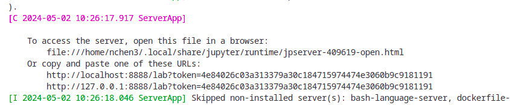
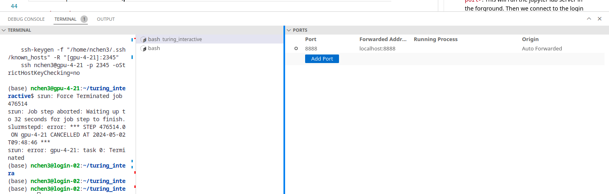

`turing_interactive` is a collection of script files designed to run on WPI's Turing Cluster interactively.

# Motivation
WPI's slurm cluster offers a simple command `sinteractive` to execute jobs on the cluster. Unfortunately, it's really difficult to use and extend. For example, you can't fork the session in the vscode, as creating a new terminal will only give you a (bash) terminal on login node, not on compute node. Also, you can't perform ssh forwarding in this setting, because the compute node has their own ssh servers for administration, so you can't directly connect to or modify them.

To mitigate this problem, this repo allows you to open a ssh connection from the login node to the compute node, then you can do a double ssh forwarding to freely connect to the compute node at home.

# Usage

After downloading this repo in the ***login*** node, firstly create a json file to specify the CPU/GPU/memory you need, then execute `python interactive_run.py --config <path_to_your_config.json>`. If `--config` is not provided, then the `default.json` will be used.

Here are the parameters you can config (it's the same as the one required by `sinteractive`):
```
REQCPU: Number of CPU per task
REQMEM: Memory, in MB
REQTIME: Maximum time, in minutes
PARTITION: Parition, must be a string
REQGPU: Number of GPU, if zero, then the REQTYP parameter will be ignored 
REQTYP: "V100" or `A100`, must be a string
```

After running the script, you get a terminal on a compute node just like the `sinteractive`. ***If you close this terminal, then your job will be cancelled***. This is to prevent you from forgetting to close the interactive session after you leave vscode or terminal.

And you can see something like (the outputs will be different depending on your username and the allocated node):
```
Run these commands to connect the network:

    ssh-keygen -f "/home/nchen3/.ssh/known_hosts" -R "[gpu-4-21]:2345"
    ssh nchen3@gpu-4-21 -p 2345 -oStrictHostKeyChecking=no
```

Execute these two commands in a login node to establish a ssh connection to compute node.

# Advanced usage

Do you want to set up something like Colab notebook on Turing cluster, then just follow the instructions.

After you connect to the login node, run `jupyter lab --port <compute node port>`.  This will run the jupyter lab server in the forground. You should see a lot of output. The most important is the server address (note : the port should be replaced by the port on your computer, which is created with the ssh forwarding from your computer to the login node). 

 

Then we connect to the login node with a new ssh session:
```
    ssh-keygen -f "/home/nchen3/.ssh/known_hosts" -R "[gpu-4-21]:2345" -L <compute node port>:localhost:<login node port>
    ssh nchen3@gpu-4-21 -p 2345 -oStrictHostKeyChecking=no
```
Don't forget to substitue the username and hostname. The main difference here is that we forward the port on the compute node to a port on login node port, with the `-L` ssh forwardinng option. You can use different ports if you want. Then we need to forward the `<login node port>` on login node to a port on our own computer. On vscode, this can be achieved by `PORTS` gui. 
 

Now you can connect to the compute node on your computer with the address. Don't forget to change the port in this address to the port on your computer.

# How it works
Since the compute node uses its own ssh server, we launch a second ssh server on a different port on compute node, then we establish a connection between the login node and compute node. 

